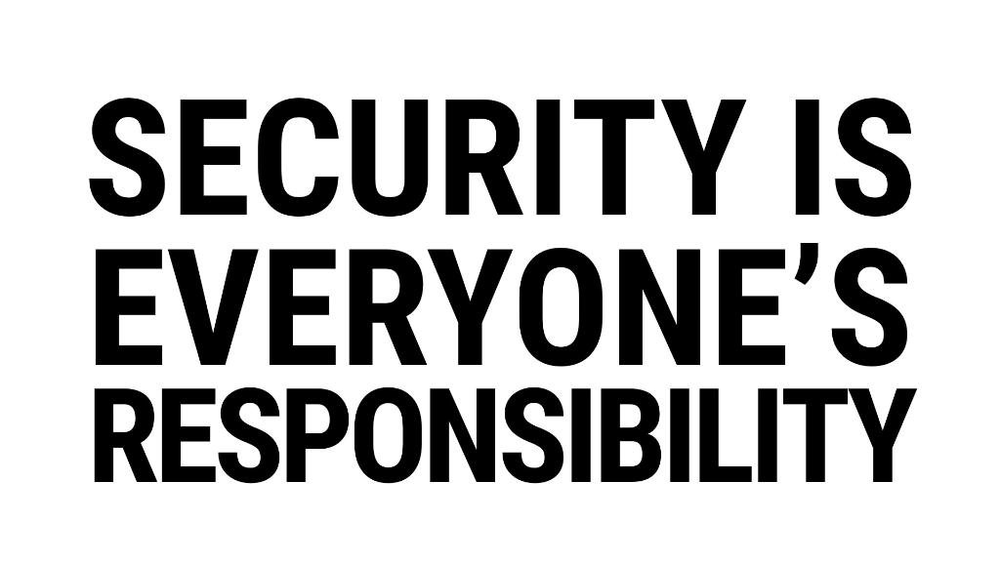

Quick brief of 2018, we saw HSBC data breach, Uber lost UK customer data, Marriott data breach. And that's just a highlight of what happened last year. One lesson we should all learn from these should be it's never too late to take security at corporate seriously.
Often security is considered as an after-thought, it is treated as an add-on to a product. Whereas security is a culture, a continuous effort. Think of it as more proactive than reactive. It is not intended to undermine reactive measures, because sometimes good reactive security controls prevent mishaps when they pass through the initial controls.

That being said, we should always keep in mind: "Security is a chain, and the weakest link breaks it". 

