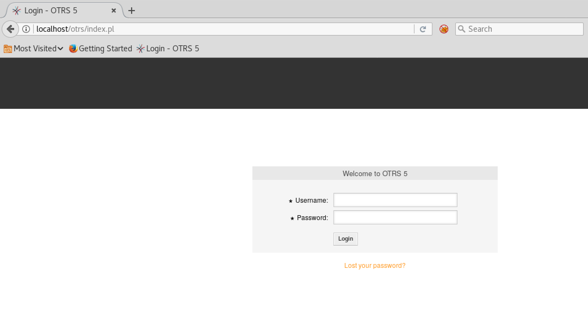
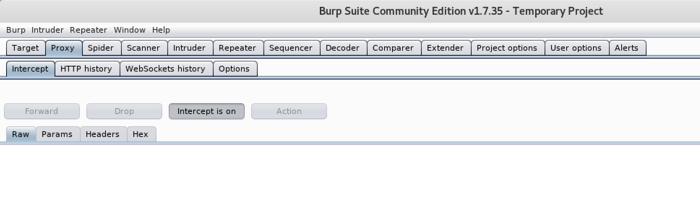
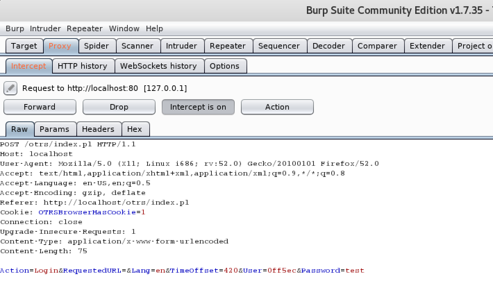
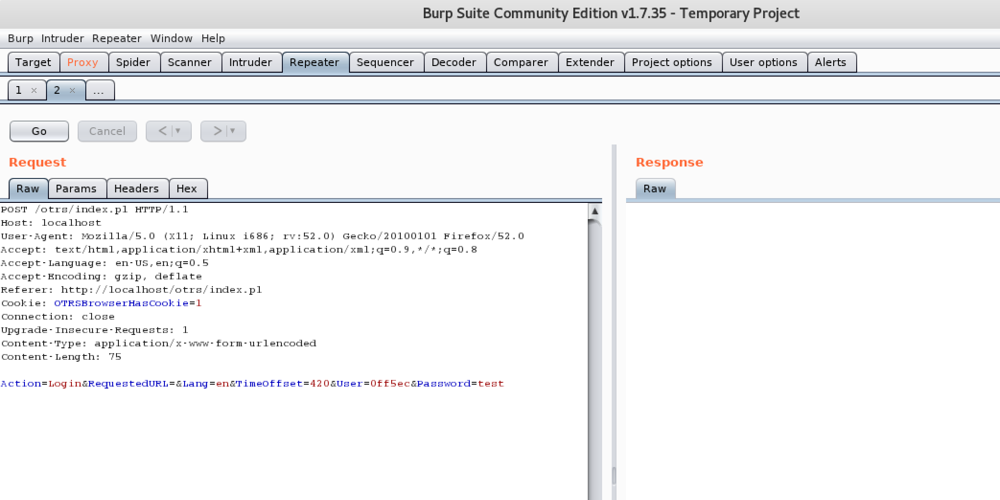
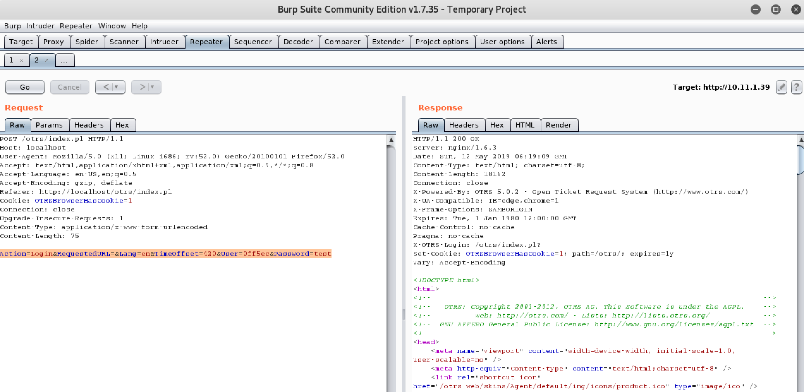
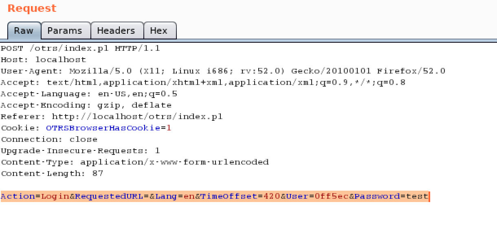
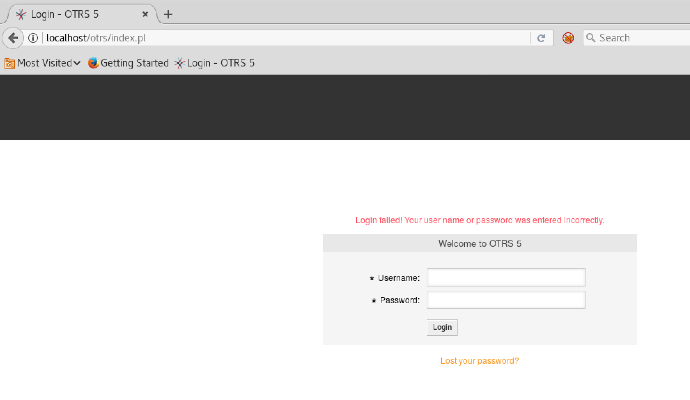
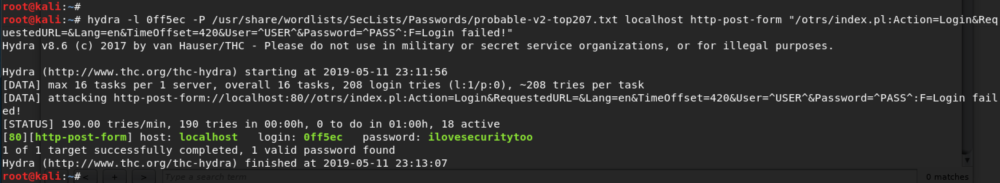
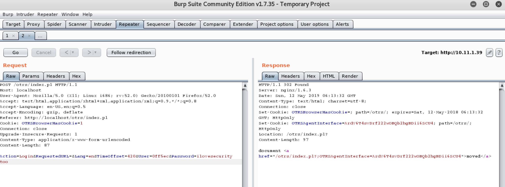

##What is Brute forcing passwords?
Brute forcing is classified as a trial and error method where an attacker tries different usernames/passwords in order to gain access finding a valid pair. There are different situationswhere we might consider brute forcing, today we are going to focus on brute forcing web application for a user's password. Often during penetration testing exercises we come across login portals into powerful web applications, which can lead to remote code execution if we can get in. Brute force should not be the first thing to try, but it is definitely one of the attack vectors.    
*Password is the weakest form of Security*, and often users use very weak password. Combining these two aspects, password brute forcing comes handy time to time in penetration test engagements. However, the chances of success of a brute force attack depends upon a few factors,
  - **Proper enumeration of the system:** Understanding whether brute force is an option or not, like verifying if CSRF tokens are set with each login requests.
  - **Account lockouts:** If a system alerts or locks out users after a certain number of failed logins.
  - **Password profiling:** Brute forcing a http login form with all possible combination of characters often is not a good idea.

Now let's go through a brute force attempt and see if we get a hit or not!

##System background:
For this exercise I have installed a random web application (OTRS) on my local Kali system and turned off the **Account Lockout**. To make this situation more realistic, I have an SMTP server set up, that I used for username enumeration to keep things simple. We are mainly going to focus about the brute forcing of the OTRS application rather than the set up and information gathering. 

###Things to verify before brute forcing a web application
As I have touched upon above, success of a brute force depends upon the due diligence of the attacker. Detailed enumeration of the system to find out usernames is always helpful and make the process much painless. Each web application has its own way to find out if account lockouts are enabled or not, if login packets are also sending a CSRF token with the POST request etc. It is always advised to go through these before trying to brute force. As the last thing you'd want to put in your report for your client is **"I have locked out the system by brute forcing your web application!"**   
To keep the focus of this post on using Hydra and Burp suite for brute force, I have already enumerated the system and below are the key findings:
> - Account lockout is disabled.
> - There's a user named "0ff5ec" present in the system, found via SMTP VRFY

##Step by step brute forcing of the web application
###Step 1: Finding the login page
Often applications login page is the index page, however sometimes index page of a web server just serves default pages. It is always recommended when dealing with web servers to perform a quick nikto scan as well as directory search using dirbuster (My favorite is the go version gobuster)!   
In this current scenario, the application was serving a default page, however playing with robots.txt and Firefox developer tools, we have found there's a directory **/otrs/index.pl** which is the default place where this application places the login portal. 



###Step 2: Setting up Burp proxy
Although Burp suite is not required to perform a brute force attack, it is my personal favorite when it comes to Web applications. I like to do things through Burp for a variety of reasons,   
1. I get full visibility into the requests that I am sending to the webapp with Burp proxy.
2. Modifying packets/request type is always easier than browser.
3. Burp repeater is very helpful to capture certain packets and examining the web app by changing different parameters is convenient.
4. Burp comes with history which comes handy for documentation purposes.   
For this exercise please launch Burp Suite and in the **Proxy** tab, turn the intercept on for intercepting any requests made from your browser to a remote server and route it through Burp.   
(If you are using Burp form the first time, please follow the steps from my: [Set up Burp](https://google.com))



###Step 3: Understanding the login POST request
Once the environment is set up, next we need to understand what are the parameters in the POST request sent to the web server when a login attempt is made, since our intercept is on, if we send a login attempt through browser, Burp is going to catch the request.
   
Looking at the intercepted request, we can see the POST data. I generally send the request to repeater `control+R`, in case I'd need to resend the same packet or perform some testing with modification to different parameters. 

Forwarding the request from **Repeater** tab, we recieve a response with invalid login attempt page. Let's keep this screenshot handy, as we can compare it to a successful login attempt later.


###Step 4: Gathering data for Hydra
We are going to use hydra's `http-post-form` module to perform brute force attack against this web server. Let's see what parameters need to be passed to hydra so that we gather them one by one:
```sh 
hydra -l username -P password-list <URL_TO_SERVER> http-post-form "<PATH-TO_LOGIN>:POST_REQUEST_FOR_LOGIN:FAILED_RESPONSE_IDENTIFIER"
```
Now we will go through each options one by one and see if we have them,
- First option **"-l"** seems very self-explanatory, this is where we pass the username. In this particular case, since we have already found an existing username for the webapp, we don't need to brute force username, otherwise, hydra supports sending a list of usernames as well, in which case you'd need to use `-L <USERNAME_LIST>` instead. The username we are going to brute force against would be **0ff5ec**
- With the **-P** option, we send the password list that we have created or going to use against this server. This often turns out to be the most crucial part of brute forcing, as which success directly depends on the quality of the password list you're using. We are going to use **`/usr/share/wordlists/SecLists/Passwords/probable-v2-top207.txt`**. There are different commonly used passwords available on Github, but sometimes you need to perform thorough enumeration to build a password list based on particular users. There's a tool named **cewl** that helps you crawl through web pages and build a worldlist. I'd highly recommend reading more about it. [More about cewl](https://digi.ninja/projects/cewl.php)
- Next hydra expects the URL of the server to be passed. This URL is the URL for the server, not the login page. The way hydra is built, it wraps the inout in this field with a prefix: `http-post-form://` and a suffix: `:80`. In our case, url would be **localhost**. 
- Now we would pass hydra that we are going to use **http-post-form** module to let it know we are dealing with http protocol and post request for login form. 
- Last is the most important part, and often less understood. Once we go through this part of the hydra command, usage of Burp Suite will be more justified. Here we pass some valuable information to hydra, like the path to login on the web server, the actual POST request and information on how to decide whether a login attempt was successful or failed. These three parameters are sent as a single string and separated by **":"**s. Let's dig in, 
  1. Path to login is basically relative path from root of the web server where the login form is located. In our case: **/otrs/index.pl**
  2. Hydra brute forces the web server by replacing the username/password iterating them through the list passed for each. Examining the POST request is important because each web server has its own way of naming username/password fields. In this case, if we look into the POST request, we see username is defined as **`User`** and password as **`Password`**. From the test request captured by Burp, it is highly recommended to copy the entire POST request and paste it in this part for hydra command. Replacing test username with **^USER^** and password with **^PASS^**, where hydra puts from the -l[-L] and -p[-P] parameters. 

  3. Lastly, we need to tell hydra how to identify a failed login. Often times this can be a string that is found on the resulting page of a failed login attempt. In our case, we saw upon entering wrong credentials, we get a page with message: **Login failed**. We can be pretty sure this string would not be present for a successful login attempt. However, sending a proper string here is very important to avoid false positives/false negatives. 


###Step 5: Brute force time!
Once we have all the information required for hydra, let's run hydra and see if we find any hit, 
```sh   
hydra -l 0ff5ec -P /usr/share/wordlists/SecLists/Passwords/probable-v2-top207.txt localhost\
 http-post-form "/otrs/index.pl:POST_REQUEST_FOR_LOGIN:F=Login failed!"
``` 


In about 1 min we see hydra has found a password for "0ff5ec" user. However, we need to validate if this is a valid credential. Going back to Burp repeater, sending this POST request below, we see something different response than what we have seen for a failed attempt. It is indeed taking action after a successful login!  


##Conclusion
Although brute force should not be the first thing on mind while assessing security, it comes in handy time to time due to human nature of resusing passwords and/or using password that are easy to remember. Always keep in mind the constraints for a successful brute force before locking yourself out. Hope this walkthrough would be helpful to some. Let's end this post with a famous quote, 
###*"Security is a chain, and the weakest link breaks it!"*  
