###Definition
There are many ways to define **File inclusion vulnerability**, I am going to use the one from OWASP,   

> The File Inclusion vulnerability allows an attacker to include a file, usually exploiting a "dynamic file inclusion" mechanisms implemented in the target application. The vulnerability occurs due to the use of user-supplied input without proper validation.

As described above, these vulnerabilites mostly come from poorly written php codes from web services where developer forgets to sanitize the input from users. Sometimes try to achieve security by obfuscation, where developers tend to hide some http parameters and feel safe about them being unsanitized. In this post, we will go over how to take advantage of such situations and exploit the vulnerability to gain **Remote Code Execution**.

```php
<?php
$file = $_GET['page'];
?>
```

Above code snippet is asking for a GET parameter `page`. Now if this input is passed to the backend server without proper sanitization and used as a part of a php statement like `include`, it creates an avenue for code execution. 
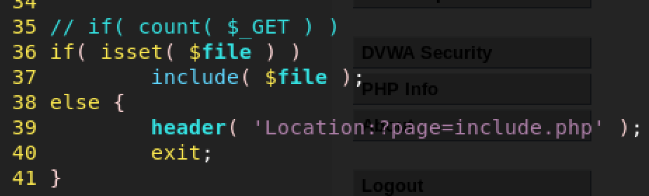

Taking a step back for a while, file inclusion vulnerabilities are often classified in two categories, 
  - Remote File Inclusion (RFI)
  - Local File Inclusion (LFI)   
 
As the name suggests, RFI may allow attacker to run arbitrary code hosted on a malicious web server, where as LFI restricts including files already present on the victim server. However, both these vulnerabilites are equally critical and lets an attcker gain shell access.  

Enough about the vulnerability, in this post we will exploit a web server vulnerable to both LFI and RFI to gain shell access on the system. This post is the first of a series on LFI/RFI, and will cover fundamentals of navigating through these vulnerabilites to gain RCE. 

###A bit about the Environment
This exercise has been performed on a Linux host running Damn Vulnerable Web App (DVWA). Attacking machine used is Kali Linux. Burp suite was used in the exploitation process, as it always eases exploitation of web services. Mainly we have used Burp proxy to intercept the requests and Burp repeater to play with getting shell on the system. To read more about DVWA, please visit [DVWA Official page](http://www.dvwa.co.uk/).
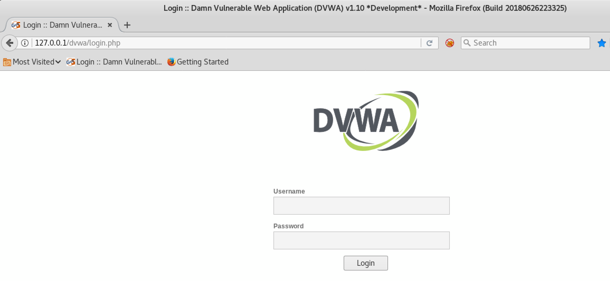

###Enumeration
Although this post focuses on exploitation of LFI/RFI vulnerability, here's a brief about how these vulnerabilities are identified. Often times file inclusion vulnerabilities are introduced when the backend server tries to execute code from a file based on users input. Identifying these can be daunting at times, as server does not generally expose the backend code to the user. However catching a HTTP request using Burp proxy reveals a lot of information about the packet sent to the web server.    
Below is the request sent to local dvwa,
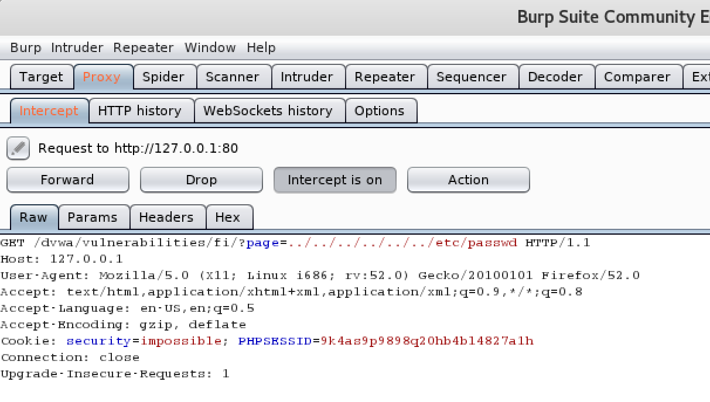
As we can see, we are sending a page parameter to the underlying web server, and at this point we can hope this parameter will be used unsantized in the code somewhere to include a file. To quickly test this, we can go back to our browser, and try to include a file we know exist on a Linux based OS and is world-readable. 

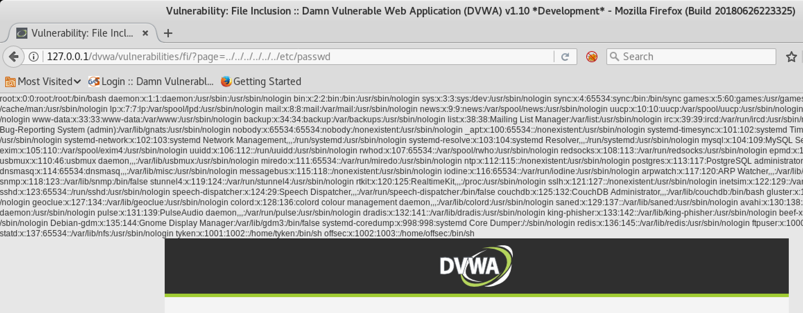
It looks like this web service is vulnerable to file inclusion. 

###Local File Inclusion to Shell
Once LFI vulnerability is confirmed, getting remote code execution is the next logical step for an attacker. I personally like using Burp for web applications, in this case we will be using Burp repeater to tweak with the page parameter and try to execute code. To use Burp repeater, after intercepting the request with Burp proxy, use `ctrl+R` to send it to repeater.    
There are many ways to get a shell from LFI, however as a part of this post, I will be only focusing on **Log Poisoning**. I will go over different techniques of LFI on a later post.   
To contaminate the log I prefer using netcat to connect to the remote web server and leave a php code in there. 
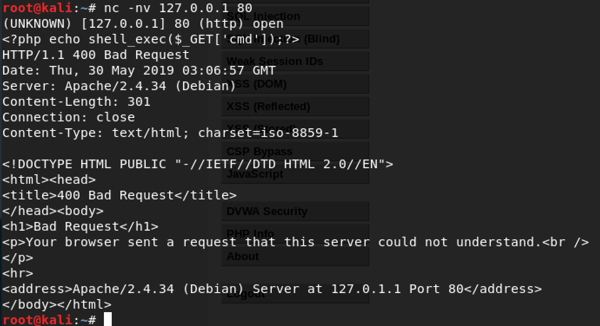

Often times on Linux OS if it is running apache, logs are located under `/var/log/apache2/` directory. Based on what we did using netcat, our php code should end up in **access.log** file. After successfully inserting our php code in log file, now if we can include that file and provide the parameter to the web server, it should execute it. Giving it a quick try with **id** command comes back with current user www-data. So now we have code execution on the remote server. 

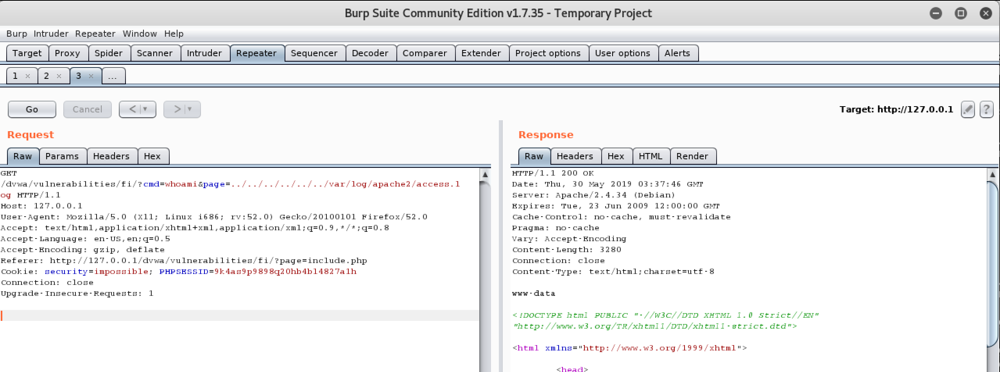  

Now it's about time for sending a reverse shell in cmd parameter. I personally keep [Pentestmonkey](http://pentestmonkey.net/cheat-sheet/shells/reverse-shell-cheat-sheet) reverse shell list close to me. My personal favorite is the second nc one which fails pretty much never!    
I tried simple nc reverse shell first, since I knew the operating system details and nc version installed, however in real world cases, sometimes due to the thin amount of error coming back to the attacker, it is often hard to predict which one is going to work. I recommend using them one by one on your best judgement and enumeration of the system. Now before sending the request from Burp, we need to URL encode the cmd parameter, select the value for cmd parameter and `ctrl+U` to URL encode. 

Bamm!

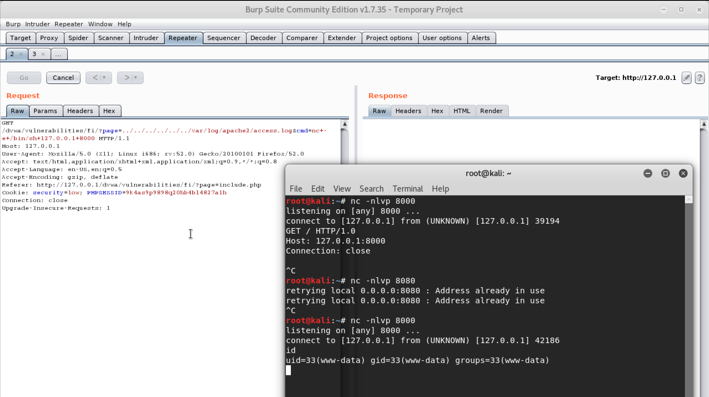

###Remote File Inclusion to Shell
Between RFI and LFI, anyone would prefer RFI as it allows the attacker to host a maclicious script on a webserver he/she controls and tricks the victim server to execute the payload. This makes the process of getting a shell very straightforward. Easiest way to test if a HTTP parameter is vulnerable to RFI is to set up a netcat listener on port X, and try to include http://IP:X from the parameter. In our example, we have found `page` parameter, so we will send a GET request to the web server with **`page=http://127.0.0.1:8000`** from Burp repeater. If it comes to our netcat listener, that will indicate the host is vulnerable.

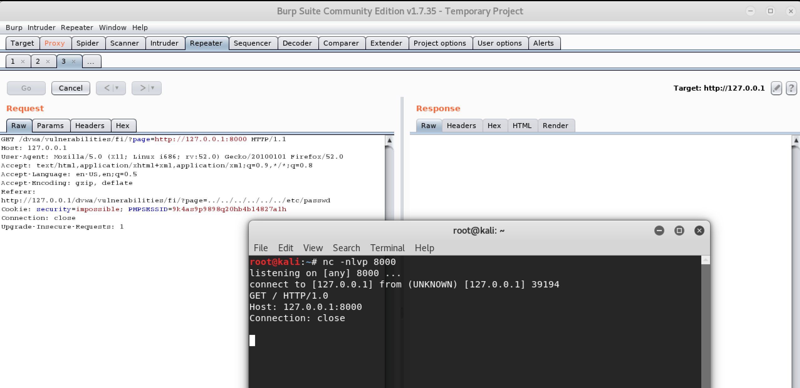
Once confirmed the vulnerability, we created a php reverse shell and hosted it using python web server on port 8000. Now including this file should get us a reverse shell.
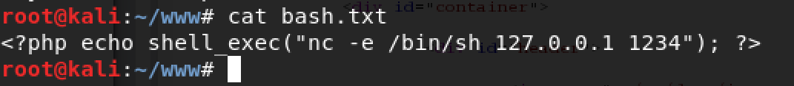
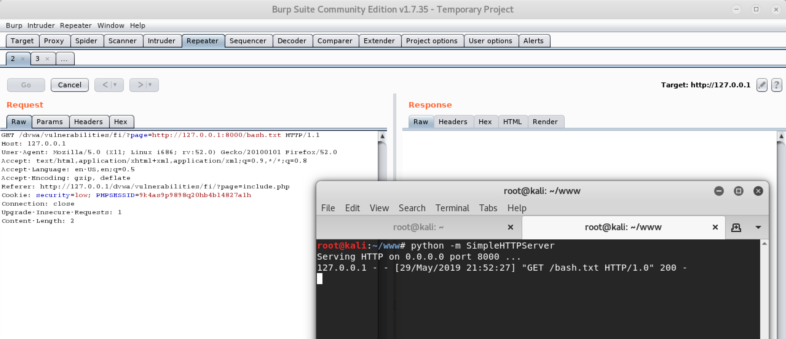
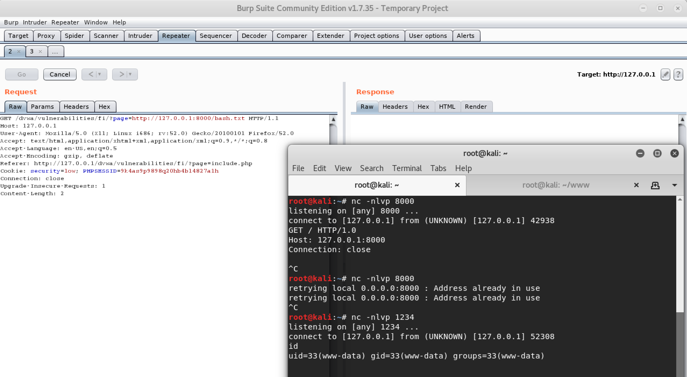

###Advantages of using Burp
It might seem Burp was an overkill for this simple exploitation, however I'd like to point out what happens in real scenarios and how Burp can come to the rescue. In this post, I have used a system that I have complete knowledge about, which is definitely not the case when we are testing an unknown web application. This introduces a lot of trials for getting a command executed and often includes an enumeration stage between confirming a vulnerability to remote code execution to reverse shell. Here using Burp repeater plays a crucial role and makes the process much easier. It also gives you more visibility into what's going into the remote web service.

###Conclusion
As we have seen RFI vulnerabilities are much easier to exploit but it is much rare than LFI vulnerabilities. However both these type would get an attacker shell access to a system. This post is planned to cover basics of LFI/RFI vulnerabilities and how to utilize them for shell. Hopefully this covered the basics of how to exploit File Inclusion vulnerabilities, and I plan to cover LFI vulnerabilities in much more depth in a future post. 
