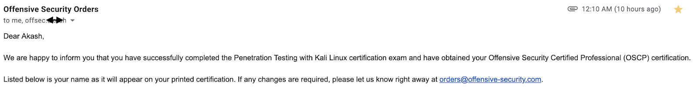
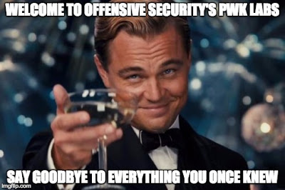
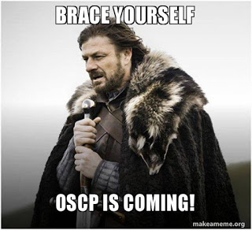
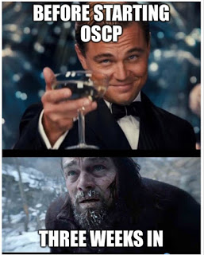
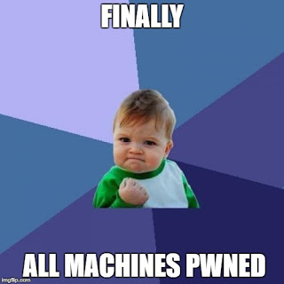
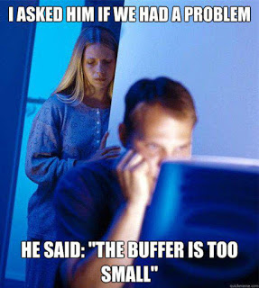

##The Good news!
Receiving the **"We are happy to inform you"** email was a unique happiness. After months of hearing **"Try Harder"**, now I feel **"I tried harder"**.
Now I am an **OSCP**, and here's my attempt to give back to the community. I have read a lot of blog posts with people explaining their experience; I'd try to stay away from the norm, and mention things that I found valuable and important.

**I hope this would help you get from "tryharder" --> "itriedharder"**

###A brief about the Course!

Penetration With Kali (PWK) is the course offered by Offensive Security, creator of Kali Linux, to help Security enthusiast building out skills as penetration tester. The unique attribute of this course is that it provides students to acquire skills through hands-on lab experience, say good bye to all those certification courses that cram you with all information but do not provide any opportunity to test your skills.    
On contrary, this course is full of challenges. You start off with basic concepts and go out to conquer the Lab network. One other beautiful thing about this course that sets it apart is its close resemblance with real world experience. I'd not go too far to say Offensive Security lab machines mimic targets we come across regularly on day to day pentests, but I can state with confidence that challenges in lab environment would not involve any CTF like elements. Generally, CTFs are designed like riddles, you solve one and make your way till you get all the flags. PWK is less about flags (proof.txt) and more about **what can you do with the access that you have!**    
 This course will teach you to do basic exploit development for Buffer overflow exploits, enumerate systems with different tools, conduct Remote as well as client side attacks, read and modify publicly available exploits to conduct attacks etc. 
In order to gain Offensive Security Certified Professional (OSCP) designation, you need to complete the course PWK and pass the OSCP exam. The tricky part about the exam is it is 24 hours long! Yes, that is tiring. I will put more light into exam and its components in later part of this post.     
Learn more: [Offensive Security](https://www.offensive-security.com/information-security-certifications/oscp-offensive-security-certified-professional/ "OSCP Homepage")

###Who should do OSCP?

  * **Interested in getting your hands dirty and bag full of real-world skills?**
  * **Enthusiast about security and appreciate hacking as an art?**
  * **Are you a penetration tester and want to showcase your skills?**
  * **Are you a developer who wants to see code from the other side?**

If  you belong to any of those category, OSCP is right for you!

Yeah, I thought I had you there... But truly OSCP is for anyone and everyone who is interested in learning more about penetration testing.

###Course Pre-Requisites:

Offensive Security advises this course not to be an introductory course, and anyone seeking should have knowledge in the following areas:

  * **Familiarity with Linux** 
  * **Solid grasp of TCP/IP and different networking protocols**
  * **Accustomed with scripting languages (Python, Perl, Ruby etc.)**
  * **Solid grasp of information security concepts**

That's the spirit! You don't have to be an expert; as long as you know how TCP works, you should be fine.   
These are okay, but the most accurate and my favorite one is (and I quote Offensive Security on this)
##*"A desire for moderate pain and suffering "*

I am not joking! This course will teach you a life lesson to **"Keep calm, and try harder!"**    
It was so hard making it through this much without saying the mantra! Yes, if you are ready to try harder and work through your pain and sufferance, this course is for you!    
Learn more: [Requirements](https://www.offensive-security.com/pwk-syllabus/)

###PWK Course Breakdown

The course itself comes with a 380 pages PDF and 20 hours of instructional videos which go hand in hand. Following one (videos) would help you skim through the other. PWK course takes care of building the fundamentals of penetration testing. Starting with information gathering, it demonstrates some attack vectors for well-known services. Course teaches you basic concepts about different protocol and how to make the best out of any situation. Once your lab is activated and you have received the course lectures, I highly recommend going through the course quickly and completing the lab exercises.    
 This is not just because you'll get 5 bonus marks (*) in your exam, but as legends say "Walk before you run". This course videos and exercises are simple enough to follow as well as important enough to fuel you for the long journey ahead!    
One of my favorite lessons of this course was how thorough they teach you to do exploit development for Buffer Overflows!

My recommendation is to complete the exercises with the videos in a week or two. During this time, do not touch any lab machines. Course exercise itself will ask you to do so, but trust me, at this point I'd leave them and progress through the course. 

###Things to focus during the whole time:

    1. Get used to tools (netcat, telnet, nmap, wireshark, Burp etc.)
    2. Learn to pay attention to detail
    3. Enumeration is the key
    4. Practice being thorough
    5. Never make assumptions
    6. Develop a plan against target    
*a comprehensive review of tools in another post 

###Welcome to PWK Lab machines!

If you have done so, you'll feel a smooth transition between labs exercises to lab machines. Lab machines are not organized in ascending order of difficulty. So feel free start wherever. My advice is to run a proper scan to identify your targets first, and try to gather as much information in the beginning. This will help you evaluate your progress in the labs. As for how I did it? 
I created a file containing all hosts, and used a random number generator to assign my next target. Of course there were exceptions. As I have stated before, being realistic is one thing I love about PWK. Which means it is much more than just grabbing the proof.txt file, there are possibility of information mining, lateral movement and all the fun stuff!     
Go get started already! Go hack the planet of PWK!

Lab machines are divided into four different sub networks, and as you progress through you might be able to unlock additional sections of the entire subnet. On each lab machine you're expected to gain highest level of system privilege, and as a proof, a proof.txt file is placed on Administrator's desktop/root directory of each machine. This file is only readable to the highest privilege user on the system. However, just reading this file is not enough, if you're planning to document a machine and receive credit. I have mentioned earlier, you can get bonus 5 marks by completing lab exercises. Well, that was not the whole truth, I was testing "your attention to detail" skill. In order to claim those 5 points, you need to document all the lab exercises (unless mentioned otherwise) as well as detailed walkthrough of 10 unique machines in the lab. Your exploitation technique for each of these 10 machines has to be unique. Wait, not finished yet, also **you have to attach screenshot of proof.txt file along with IP address by running (ifconfig/ipconfig) in a shell.** A lot of requirements huh!!??!! Don't be me, and please pay attention to this at the start of the course. I realized this when I was pwning my 37th machine, and I had to go back into each one of those to get the screenshot! Pretty dumb huh! Who said I am smart, lol.   
For those of who has a 9-5 job like me, this is going to be hard. With all the pressure at work, make sure to spend 4-6 hours a day in the labs and having a 90 days lab access is helpful.

If you are not coming in as a professional penetration tester, OSCP offers a tremendous learning curve, one of the best in the industry. Everything comes at a cost, the learning curve is very steep at the beginning of the course. Good news, once you cross the barrier, you'll see through it! 

###Tips to make the most out of lab machines: 

  * Never leave any page unturned, do not make any assumptions about the system. Start with considering the system might run all the firewall rules to block you, there might be account lockouts on brute forcing, host might have anti-malware installed. Consider crafting your attack path in a way, none of these would matter. Do not assume a system would be open without any evidence.    
  * Try to identify the installation timelines on applications a host is running. There are several ways to identify which version of operating system is running just by grabbing SSH banner. Bookmark these URLs. Identifying installation date gives you a solid idea about the time the system might be patched the last time, this can be a good indication which exploit should/shouldn’t work.   
  * Before running an exploit, question yourself why the exploit should work, have you verified command execution by simple commands before a reverse shell? Take small steps instead of rush into exploit mode. Remember one thing, the lab is for you to learn as much as you can. This is not a place to brag, I got 10 machines in 10 mins. (BS)   
  * One more thing to remember, every machine is hard and each one of them is easy. Everything is easy with hindsight. Choose to ignore comments like “super easy machine, rooted in 10 mins”, don’t feel "I am not good enough" by reading these.   
  * Enumeration is the key! You must have heard it all over the place, but this is really important. For example, let’s say you have come across a web service. Try to find the exact version string, read documentation. Ideally, we should download the product, make a local deployment, test there if possible, but this takes a lot of time. However, in some cases, doing so is helpful and provide you the perspective of a sysadmin.   
  * As you progress through the lab, if you have decided to document machine and get those 5 marks, do not procrastinate on this. Write up walkthroughs as soon as you’re done with a machine. For those who are not looking to submit any report, I’d say write detailed walk throughs anyway. As a penetration tester, it is a very important skill to be able to present the findings to your client. With each machine documented, you’ll notice your skills are drastically improving!   
  * Make yourself a schedule as you progress, and measure continuously. This would help you see where you stand, and how far you have gotten since you have started.   
  * **Do not skim through forum posts before starting with a machine!** There’s a reason I put it in bold. Again, lab is for you to learn, not rush to get proofs. Forum is there to help you when you are stuck for a long time, even in that case, first thing you should do is to move onto a next target and come back later to current one. Forum posts contain more spoilers than you’d imagine. I used forum posts after I have rooted a machine and wanted to get perspective of other students. You don’t believe me, do you? There were two things I have used to avoid forums before owning system, one, talking to an Offsec Admin on chat support, you can be pretty sure they won’t give you any spoilers, all they would say is to try harder, but what matters is the way they say it. I have found Admins extremely helpful throughout the course. Second, I used to talk to my friends who has very limited security knowledge explaining every detail of my steps; until I found out what was I doing wrong! (This is called rubber duck debugging)    

Sometimes this is all you need to get over a problem, hope. One thing I feel everyone should practice is making skeleton attack paths for different famous ports (21, 80 etc.). List down your tools as you go through the machines and attach them to respective port numbers. This helps you in two ways, you don't forget to enumerate just by looking at your skeleton cheatsheet, secondly, it helps you remember plethora of tools you're going to be using during this course and hopefully throughout your career!   

If you have managed to root every machine in the labs, kudos to you! Great job! However, there is no linear correlation between the number of machines you have pwned in the lab and your chances of passing the exam. There are people who passed the exam, when they have just pwned 10 machines from lab, and there have been instance where people with more than 40 rooted machines have failed to pass the exam. This is not to discourage you to root machines, but to remind you that it is not about getting the proof file, it is about the learning you gather!  

###OSCP Certification Exam

Enough with what to do what not to do, now I am gonna write about the final riddle! Once you're all set with your labs, to get OSCP certification completed, you'll need to pass the OSCP exam. A brief about this exam and its structure:   
[Read more...](https://support.offensive-security.com/oscp-exam-guide/)

  * There are many unique things about the PWK course, but this is by far the outlier. OSCP is a 24 hours long exam, many of you might consider it intimidating, but this is actually very interesting. You have 23 hour 45 minutes to complete the assignment. You can think of it as a last minute penetration testing job given to you by the biggest client of your firm. Having such exam structure puts Offensive Security certification in a completely different position than all other reputed certifying authorities. I’d not say it is painless, but no achievement is painless. This particular characteristic makes OSCP a complete hand-on certification and proves your capability to handle pressure. Personally, until I do something hands-on, I feel like I have not done anything. OSCP is your friend if you are like me.   
  * The exam will have several machines for you to compromise. There are two levels of access, non-admin user and administrator/root. You’ll be marked partially for each level of access, so be sure to include everything you have found out in your report.   
  * You need to submit the local/proof keys that you find on the exam control panel with associated IPs.   
  * Metasploit usage during the exam is restricted to 1 system. This includes auxiliary, exploit, post modules within the framework. You can choose which system you want to use Metasploit on, and once you do run Metasploit (msfconsole), irrespective of if it worked, you have lost your allowance. So be mindful, if you listen to me, don’t even think about using Metasploit for first 20 hours of the exam, but keep a track of any exploits that you found in your notes. This can be a life saver! No restrictions applied to msfvenom or **“exploit/multi/handler”**, you can use this for staged payload in any number of machines, just not a meterpreter shell.    
  * Passing marks for the exam is 70, and you can get a maximum of 100 (105 with lab bonus). This is quite a handful marks, but always shoot for compromising all machines.   
  * Once you have completed your first 24 hours or ended your exam VPN, timer of 24 hours starts for your report submission. In my opinion, which can be a lot, but can be daunting as well. Because you might not have your screenshots in place, and you’re already tired!    
  * Your exam documentation is mandatory, and it needs to be a detailed walkthrough so that someone can reproduce your steps. One more important thing about the report, it should contain screenshots of the keys (local/proof) you find on each system with ipconfig/ifconfig. The reason for this is, you need to prove you have shell access to the machine. Be mindful, web shells do not count!    

There are many things about the exam that you learn firsthand, but some of them are easy to avoid. I am gonna try my best to remember any of those things that you need not to go through. I was thinking of avoiding eat, sleep which is on every other reviews, but for the sake of completeness, I am going to put them as well, so please bear with me!

###Things I wish someone had told me about D-Day:

  * It is a 24 hours exam, so be prepared with food, comfortable arrangements and lots of sugar and water! I am a kind of person who cannot just take breaks when a problem is not solved, and yes, that is a bad idea! Continue to take breaks at regular interval, get some fresh air, you might be still thinking about the box you’re stuck at, but do something else too. Keeping things off from your mind even for a minute might help you something that was right in front of you all along! I have experienced this, I was staring at a webpage login, and password was all over the place but couldn’t see it. Took a break for 5 mins, and bam! Fill your stomach, OSCP is not a sprint, it’s a marathon. I have put in sugar there because it stimulates your brain. But please consider your dietary restrictions before!   
  * ALWAYS do a full port scan, never leave this avenue unexplored.    
  * Backup, backup, backup! Thank me later! People have experienced sudden VM crash right after exam with no trace of screenshots or data! That is the most unfortunate thing that can ever happen to you! People say have a live screen record on, but I feel that’s too much of disk space. My suggestion is to take a snapshot of your VM after you have started your exam, i.e. you have all vpn files transferred, and then on each milestone (shell access to machines), finally at the end of your exam. Call me paranoid, but god forbid, if you are in that situation, you will thank me later!    
  * Whenever you get a shell (user/root), print the flag with ipconfig/ifconfig take a screenshot, submit the key in control panel, before moving on. This keeps you organized and does not let you miss anything!   
  * When you’re enumerating please keep notes of what you have done. Commands you ran, tools you have used. I personally recommend using Google docs, as it is readily available from anywhere and backed up 8 times! You might not get all systems at first go, that time it saves you time and quickly come back where you were. Sometimes, when you are stuck don’t know what to do, my personal suggestion is to open up a new terminal window, start from very first nmap scan and go from there.    
  * Continue to rotate between machines if you’re stuck. It is also important to stick to a machine long enough so that you make meaningful progress. There’s no ideal time, but 2-3 hours seems the most accepted. If you find yourself stuck for 2 hours, might be a good idea to switch machine, but if it is your last machine, God be with you! LOL!! Take breaks but at this point you should be happy anyway!    
  * I like to output my nmap scans into files, so that I don’t have to scroll every time I want see which ports were open. Also, for report purpose it is pretty helpful. Screenshots of your enumeration is the hardest as you do a n number of things, some of them works some does not. Ideally you should take screenshot for each machine as soon as you’re done with it, but oh well, whatever works best for you. I use the adrenaline from one machine as a boost on the next one!   
  * OSCP is known to be a close to real world certification. It is up to you to make it closer. Penetration test reports are generally sent back to developers for them to fix! So, what makes a good report? Easy to reproduce… Detailed… Something for everyone… Just follow these rules when you are writing your report. Try to put the commands that you ran, exploits that you have used, anything that you have changed from the PoC exploits with supporting screenshots. Include a high level summary with key findings.    

##My Exam:

Exam scheduled to start at 11 AM. I am not really a morning person, but after you wake up, performance of your brain is at its peak! So I prefer morning slots for exams. Started 15 mins early to complete my verification with invigilator, set up camera from a second laptop (always recommended), started screen connect etc. Gave the invigilator a tour of my house lol. They are very helpful, please be nice to them! I know some of you have privacy concerns, but they are here to make your life easier. Once verification is done, I received my exam package (just VPN lol) right at 11 AM. You need to do a second stage of verification by running the troubleshoot.sh script that they send you after connecting to VPN. Once all done, you are set to go!    
I had a plan of starting with the highest marks machine and walk my way down. Partly because after 12 hours your brain is fried and everything is at God's mercy, just kidding, but partly true. One thing I always like to do is run the necessary nmap scans in the background for all machines in the beginning with output files. As I was making good progress on my first machine, all my nmap scans were running. Saves time, if you need it. 1:30 hours into the exam, first machine done, moving onto the second high number machine.    
You need to know one thing about me, so you can relate. I am not a Windows guy, it freaks me out. When I see a linux machine, I know I will do something to get access. OSCP exam has no promise, you might get a all windows, all linux, any combination. First thing I saw was how many of what I got.     
**1 PM,** second high marks machine is done. This was a real confidence boost, and I was feeling, oh well, I might make it through lol. Now having those nmap, and quickly spawning mandatory enumeration for ports I have seen is no more getting me anything. I promised myself to stay in course and go down from higher to lower marks. But after an unsuccessful and tiring 6 hours session (3+3 on each, I practice what I preach, in case you were thinking). I decided to go to the lowest marks machine. At this point my brain has suffered failure in past quarter of the day, so definitely I was not thinking straight. It took me another 3 hours to get this one. But that success changed the game. Right when I went back to one of the machine that was failing me earlier, I got a shell, and guess what priv esc was as quick as 10 minutes. This was one of the first things I see on a windows box! Now I was at a point, left with only one machine and knew I have passed. I spent next couple of hours chilling with the last machine.    
Around 2 AM I went to sleep and set an alarm for 4 AM. I left my screen shared but disconnected the web cam after getting permission from the invigilator. But guess what, I woke up straight around 8:30. I was freaked out at first, but I knew I have the marks to pass, so came back sane. Spent remaining hours on the last machine and also to make sure on taking screenshots. At 10:45 AM, my VPN was disconnected and I was off to report. There are two things to pick up from here, keep switching machines, and sleep is very important, of course not 6 hours sleep, but even if you sleep for 1:30 hour that makes a difference.     
 I submitted my report (45 pages) the same day, heavily armed with screenshots. Prepared the zip file with my exam and lab report, sent it home to receive a confirmation almost instantly. Within next 24 hours I received the most delightful email so far!   

###Conclusion: 

In a nutshell, OSCP is a perfect way to hone your security skills and get your hands dirty. I recommend this course to anyone who (is)   
  * **Enthusiast about security and appreciate hacking as an art.**
  * **A penetration tester and want to showcase your skills.**
  * **A developer who wants to see code from the other side.**
  * **Just want to have a good time hacking through the network.**

OSCP is one of the certification I am really proud of. I can vouch you'd enjoy the lab environment if you like challenge. PWK provides great opportunity for you to test your technical skills and patience. If you can master these, you'd see yourself advancing in your career and in the industry. Good luck! **"Try Harder!"**

Hope you have enjoyed the post. I am going to post a few other more technical posts with tool reviews, handling different situation you come across during a penetration test in focus. Stay tuned for new posts!
