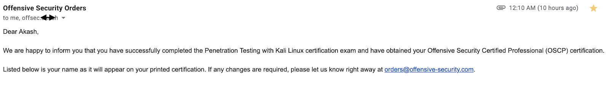

##The Good news!
Receiving the **"We are happy to inform you"** email was a unique happiness. After months of hearing **"Try Harder"**, now I feel **"I tried harder"**.
Now I am an **OSCP**, and here's my attempt to give back to the community. I have read a lot of blog posts with people explaining their experience; I'd try to stay away from the norm, and mention things that I found valuable and important.

**I hope this would help you get from "tryharder" --> "itriedharder"**

Lorem Ipsum is simply dummy text of the printing and typesetting industry.
Lorem Ipsum has been the industry's standard dummy text ever since the 1500s,
when an unknown printer took a galley of type and scrambled it to make a type s
pecimen book. It has survived not only five centuries, but also the leap into
electronic typesetting, remaining essentially unchanged. It was popularised in
the 1960s with the release of Letraset sheets containing Lorem Ipsum passages,
and more recently with desktop publishing software like Aldus PageMaker including
versions of Lorem Ipsum.

## Why do we use it?

It is a long established fact that a reader will be distracted by the readable
content of a page when looking at its layout. The point of using Lorem Ipsum
is that it has a more-or-less normal distribution of letters, as opposed to using
'Content here, content here', making it look like readable English.
Many desktop publishing packages and web page editors now use Lorem
Ipsum as their default model text and a search for 'lorem ipsum' will
uncover many web sites still in their infancy. Various versions have evolved
over the years, sometimes by accident, sometimes on purpose
(injected humor and the like).
